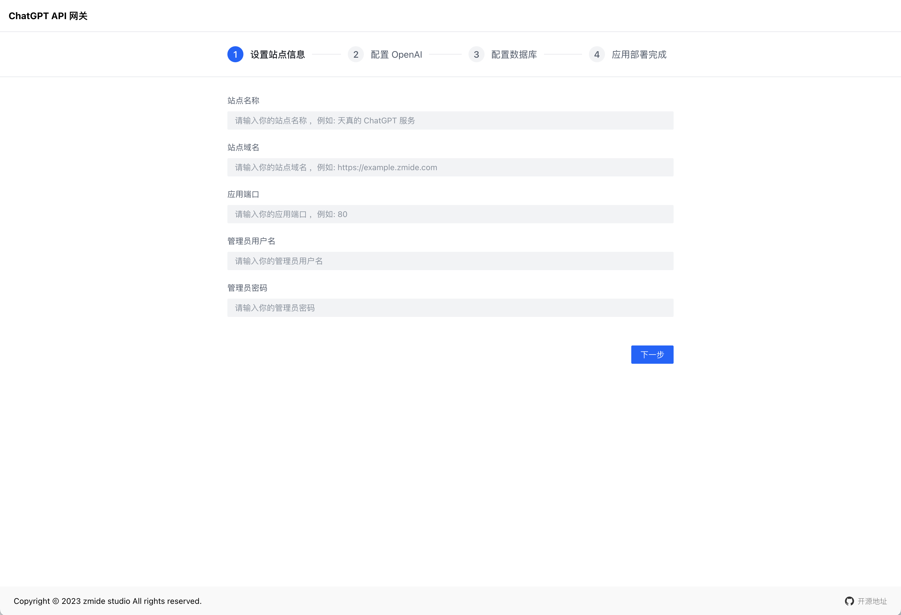
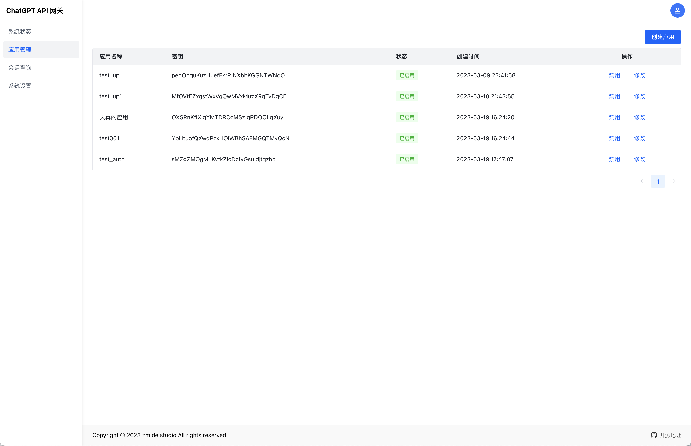

<!--
 * @Author: Bin
 * @Date: 2023-03-05
 * @FilePath: /gpt-zmide-server/README.md
-->
# gpt-zmide-server 💡

[](https://github.com/PBK-B/gpt-zmide-server)
[
](https://hub.docker.com/repository/docker/pbkbin/zmide-gpt-started/general)


> zmide ChatGPT 应用服务，用于管理应用程序对接和集成 ChatGPT API 的服务应用，提供简单易用的 API 服务。

## 开始 🎀

### Build Run

1. 创建 `app.conf` 配置文件

2. 启动服务 `go run .`

3. 访问 `http://127.0.0.1:8091/install` 开始安装

4. 访问 `http://127.0.0.1:8091/admin` 登录管理后台

### Docker Install

```
docker push pbkbin/zmide-gpt-started:v1
```

## 文档 📜

API 文档请参考: [docs/README.md](/docs/README.md)

## 截图 🔦






## 计划

- [x] 安装引导页面

- [ ] 后台会话查询

- [ ] 后台系统设置

- [ ] 敏感词过滤设置

- [ ] 应用请求限速设置

- [ ] 应用单独配置模型

## 开发 🔨

```shell
# 启动前端
yarn && yarn dev

# 启动后端
DEBUG=1 go run .

# 编译项目 (跨平台交叉编译可以修改 Makefile go build 相关参数)
make all
```

## 谁在使用

- [全能搜题](https://github.com/zmide/study.zmide.com) 全能搜题项目是一个基于开源社区公开贡献的永久免费搜题系统。

## 感谢支持 😋

- [OpenAI](https://openai.com/) Creating safe artificial general intelligence that benefits all of humanity

- [gin](https://gin-gonic.com/) Gin Web Framework

- [gorm.io/gorm](https://gorm.io/) The fantastic ORM library for Golang


